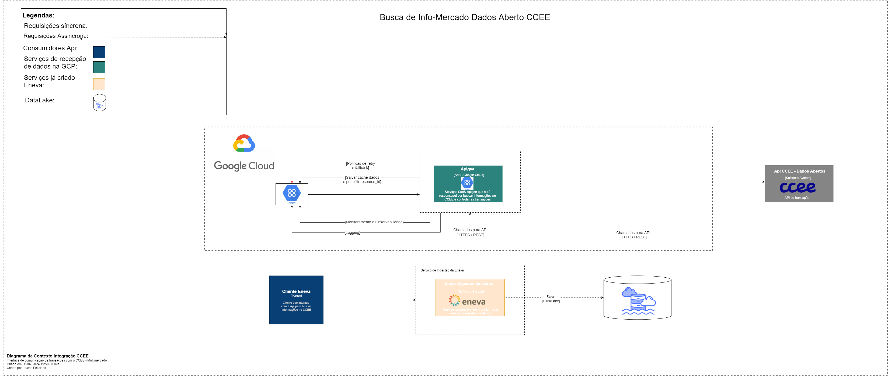
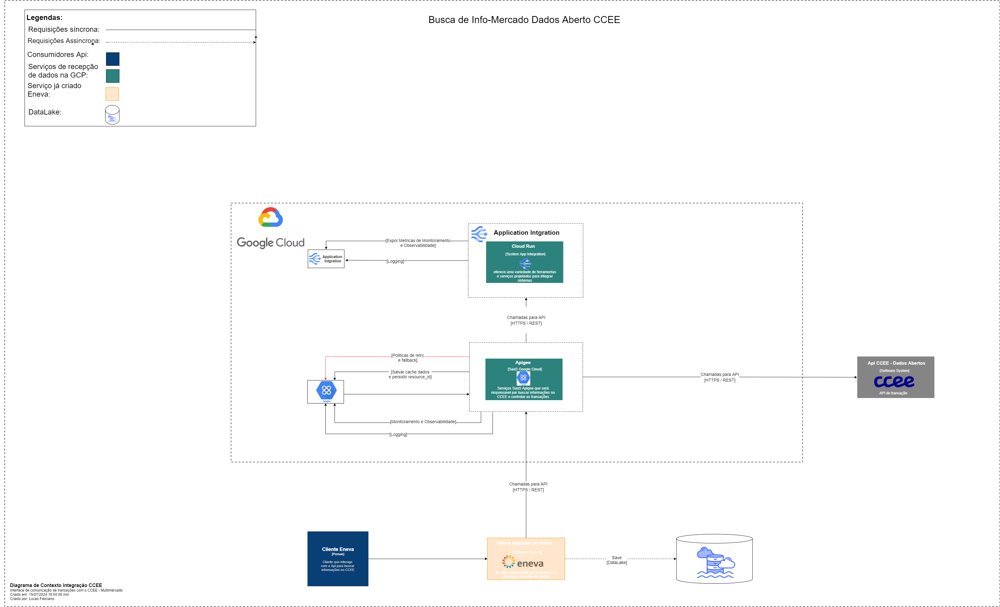
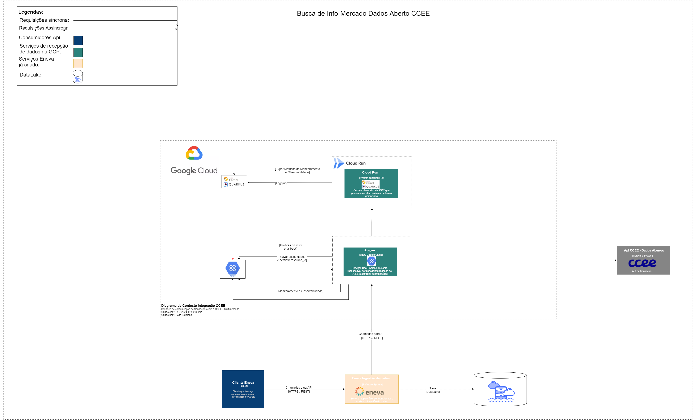

# **Busca de Datasets - Informercados**

# Objetivo

Objetivo da documentação é descrever os processos tecnologicos para promover uma busca de informações de datasets e realizar a ingestão dessas informações em um ```DataLake```. Temos como primicia usar soluções de provider ```Google Cloud Platform (GCP)```

# High Level Design

High-Level Design (HLD) é uma fase do processo de desenvolvimento de software que visa fornecer uma visão abrangente e macro do sistema ou aplicação a ser desenvolvida. Este documento detalha a arquitetura e os principais componentes do sistema, sem entrar em detalhes específicos de implementação.

# C4 Model

O modelo C4 (Context, Containers, Components, and Code) é uma abordagem de modelagem arquitetural que descreve a arquitetura de um sistema de software em diferentes níveis de detalhe. No documento abaixo iremos trabalhar com dois tipos: ```Diagrama de Container``` e ```Diagramas de contexto```. Dentro deste modelo, o Diagrama de Containers serve para descrever a arquitetura do sistema em um nível alto, focando em como o sistema é decomposto em contêineres e como esses contêineres se comunicam entre si. Segue abaixo o Diagrama de Container.


Agora, o ```Diagrama de Contexto``` ilustra como o sistema se encaixa no ambiente em que opera e como interage com os usuários e outros sistemas. Ele apresenta o sistema como um todo, ajudando a entender seu propósito e escopo, ao mesmo tempo que destaca as interações entre o sistema e os atores externos, como usuários e sistemas de terceiros. A seguir, o Diagrama de Contexto:



# Stack tecnológico

- Google Cloud Platform (GCP)
- Apigee API Management
- Customer Data Platform (CDP) Google Cloud
- App Integration Google Cloud
- Cloud run Google Cloud

# Detalhes de Requisitos

##### **Cliente Eneva**
1. O cliente Eneva chamará uma API disponível no Apigee. Esta API permitirá a consulta de quatro conjuntos diferentes de datasets, que são: 

- CONSUMO_MENSAL_PERFIL_AGENTE	fev/24	https://dadosabertos.ccee.org.br/api/3/action/datastore_search?resource_id=3211839f-54b1-460e-92f3-e4c4b307f376
- CONTABILIZACAO_MONTANTE_PERFIL_AGENTE	fev/24	https://dadosabertos.ccee.org.br/api/3/action/datastore_search?resource_id=d47f9660-28d6-4542-9dbc-9648e13b3c67
- CONTRATO_MONTANTE_COMPRA_VENDA_PERFIL_AGENTE	fev/24	https://dadosabertos.ccee.org.br/api/3/action/datastore_search?resource_id=f6b478a0-bf4d-4d18-8f7f-067d01fefbd0
- PARCELA_USINA_MONTANTE_MENSAL	mai/24	https://dadosabertos.ccee.org.br/api/3/action/datastore_search?resource_id=5c64e360-0252-4849-9dbb-8a61cb2af8f0

para o Dataset:
- PARCELA_USINA_MONTANTE_MENSAL: os dados são disponibilizados mensalmente, ou seja, a cada mês a consulta da API retorna informações do mês corrente

para os Dataset:

- CONSUMO_MENSAL_PERFIL_AGENTE
- CONTABILIZACAO_MONTANTE_PERFIL_AGENTE
- CONTRATO_MONTANTE_COMPRA_VENDA_PERFIL_AGENTE, os dados são atualizados anualmente e cada consulta retorna informações do ano corrente.

- É necessário armazenar a informação de ```resource_id```, pois ele muda a cada ano. Com a virada do ano, será preciso realizar uma consulta passando o dataset como parâmetro para obter um novo ```resource_id``` para as consultas nos datasets.

Segue a api para consulta de um novo ```resource_id```

https://dadosabertos.ccee.org.br/api/3/action/package_show?id=parcela_usina_montante_mensal

Aqui está uma parte do JSON onde é necessário armazenar o campo ```id``` na lista de ```resources```.

```json
  "resources": [
      {
        "cache_last_updated": null,
        "cache_url": null,
        "created": "2024-05-28T14:27:44.033600",
        "datastore_active": true,
        "description": "",
        "format": "CSV",
        "hash": "",
        "id": "**5c64e360-0252-4849-9dbb-8a61cb2af8f0**",
        "last_modified": null,
        "metadata_modified": "2024-07-11T20:53:42.882907",
        "mimetype": null,
        "mimetype_inner": null,
        "name": "parcela_usina_montante_mensal_2024",
        "package_id": "f9359047-7041-41ae-98f8-5e123b980dcd",
        "position": 0,
        "resource_type": null,
        "size": null,
        "state": "active",
        "url": "https://pda-download.ccee.org.br/8RNRVRPPRNGOtMmNTAUnXQ/content",
        "url_type": ""
      }

```
2. Quando o endpoint no Apigee for chamado, o Apigee terá que buscar informações nos datasets já mencionados, que são:

- CONSUMO_MENSAL_PERFIL_AGENTE	fev/24	https://dadosabertos.ccee.org.br/api/3/action/datastore_search?resource_id=3211839f-54b1-460e-92f3-e4c4b307f376
- CONTABILIZACAO_MONTANTE_PERFIL_AGENTE	fev/24	https://dadosabertos.ccee.org.br/api/3/action/datastore_search?resource_id=d47f9660-28d6-4542-9dbc-9648e13b3c67
- CONTRATO_MONTANTE_COMPRA_VENDA_PERFIL_AGENTE	fev/24	https://dadosabertos.ccee.org.br/api/3/action/datastore_search?resource_id=f6b478a0-bf4d-4d18-8f7f-067d01fefbd0
- PARCELA_USINA_MONTANTE_MENSAL	mai/24	https://dadosabertos.ccee.org.br/api/3/action/datastore_search?resource_id=5c64e360-0252-4849-9dbb-8a61cb2af8f0

3. O Apigee precisa ser capaz de gerenciar o ```cache``` de informações.

4. O Apigee deve suportar políticas de ```retry``` para lidar com a indisponibilidade dos endpoints da ```CCEE``` ou ```timeouts```.

5. O Apigee precisa ter a capacidade de realizar ```reprocessamento``` caso os serviços da Eneva estejam indisponíveis para entrega da informação.

6. O Apigee precisa ser capaz de agendar a chamada de APIs externas da CCEE em momentos específicos, sem depender de chamadas HTTP/REST diretas.

### Cloud Run

O Cloud Run é um serviço da Google Cloud Platform (GCP) que permite executar contêineres de forma gerenciada e escalável na nuvem com isso conseguimos  executar contêineres em um ambiente serverless, o que significa que você pode executar código sem se preocupar com a infraestrutura subjacente. Um dos beneficios dessa solução seria a escala automatica com base na demanda. O Cloud Run inicia novas instâncias de contêineres conforme necessário para lidar com picos de tráfego e reduz automaticamente quando a carga diminui, ajudando a otimizar os custos.

Essa solução pode ser adotada caso algum requisito de resiliência, negócio ou técnico não seja totalmente atendido. Por exemplo, se houver métricas de relatórios ou observabilidade que não possam ser construídas ou exibidas através do Apigee, pode-se optar pelo desenvolvimento de uma API no ```Cloud Run``` para controlar transações e expor métricas de forma mais controlada.

### Application Integration

Existe uma terceira como combinação seria utilizar o ```API Management```, o Apigee e também o ```Application  Integration``` da Gcp, com isso dividindo algumas responsabilidades entre ```Apigee``` e ```Application  Integration```. O Application Integration no Google Cloud Platform (GCP) oferece uma variedade de ferramentas e serviços projetados para integrar eficientemente sistemas e serviços de software. Utilizar o Application Integration da Google proporciona diversos benefícios significativos para organizações que precisam integrar aplicações, sistemas e serviços de maneira escalável e eficiente. Ele suporta integrações em tempo real, batch e eventos, adaptando-se às necessidades específicas de cada caso de uso.

Além disso, a solução oferece ferramentas integradas de monitoramento e gerenciamento, como Stackdriver Monitoring e Logging, que permitem acompanhar o desempenho das integrações, diagnosticar problemas rapidamente e otimizar recursos. A GCP disponibiliza serviços gerenciados que simplificam a integração, eliminando a necessidade de gerenciar infraestrutura subjacente. Isso inclui serviços como Cloud Pub/Sub para mensagens e Cloud Dataflow para processamento de dados, que escalonam automaticamente conforme a demanda, reduzindo a complexidade operacional.

Os serviços de Application Integration da GCP operam com base em um modelo de pagamento conforme o uso, onde você paga apenas pelos recursos consumidos. Isso elimina custos fixos associados à infraestrutura subutilizada e permite escalar recursos de acordo com as necessidades específicas do negócio.

Segue um exemplo abaixo de como seria um desenho arquitetural  utilizando o ```App Integration```:



### High Level Design utilizando o Cloud Run

Segue abaixo o Diagrama de contexto caso seja necessário utilizar o ```Cloud Run```




### Resiliência

A resiliência de API se refere à capacidade de uma aplicação ou serviço de API continuar a funcionar de maneira confiável e previsível, mesmo diante de falhas ou condições adversas. É um aspecto essencial na arquitetura de sistemas distribuídos, especialmente em ambientes de nuvem e microserviços, onde múltiplos componentes interagem entre si e estão sujeitos a falhas ocasionais.

Diante disso, dentro do nosso ```API Management```, o Apigee será feita toda a orquestração de resiliência da API. Se necessário, partes dessa resiliência podem ser implementadas através do desenvolvimento (utilizando uma linguagem que atenda o requisito de negócio) de uma API que será executada no ```Cloud Run```.


### Observabilidade

Observabilidade de API é a habilidade de monitorar, analisar e compreender em tempo real o comportamento e o desempenho de uma API. Essencial para assegurar que aplicações baseadas em API operem de maneira confiável e eficiente, permite diagnósticos rápidos em situações problemáticas.

Nesse contexto, a observabilidade será gerenciada através do nosso ```API Management```, o Apigee. Caso os gráficos e personalizações feitas pelo Apigee não atendam completamente a alguma métrica ou requisito de negócio, existe a opção de desenvolver APIs para serem executadas no ```Cloud Run```. Assim, essas APIs podem expor métricas de forma a satisfazer integralmente os requisitos técnicos e de negócio.


### Rastreabilidade

A rastreabilidade em APIs refere-se à capacidade de acompanhar e registrar detalhadamente o caminho que uma requisição percorre ao atravessar os diversos componentes de um sistema distribuído, ela permite identificar e resolver rapidamente problemas de desempenho, erros ou falhas em requisições, minimizando o impacto nos usuários e nos negócios. Dado essas informações o nossso ```API Management```, o Apigee será o responsavel em mostrar toda a ```Rastreabilidade``` das Api´s.


### Logging

Os logs em APIs desempenham um papel fundamental na gestão e operação eficiente desses serviços, como exemplo os logs registram métricas como tempo de resposta, latência, taxas de erro e uso de recursos, permitindo monitorar o desempenho da API em tempo real. Isso ajuda na detecção precoce de problemas de desempenho e na otimização da capacidade. Para esse recurso o nossso ```API Management```, o Apigee oferece funcionalidades abrangentes de logging para APIs. Ele registra informações detalhadas sobre cada requisição que passa pelos seus serviços, permitindo um monitoramento completo e uma análise detalhada do tráfego das APIs gerenciadas.
